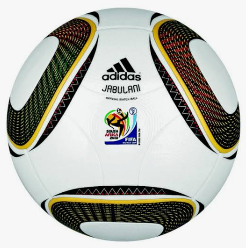

# Temas del curso

### 16/09 · Mis aficiones

Una de mis mayores aficiones es el fútbol.
Me gusta mucho jugar con mis amigos y entrenar con mi equipo varias veces a la semana.
Mi posición favorita es de delantero porque me gusta marcar goles y ayudar al equipo.
También disfruto viendo partidos importantes con mi familia, especialmente cuando juega mi equipo favorito.
El fútbol me ayuda a mantenerme en forma, trabajar en equipo y pasarlo bien con mis amigos.

Buscando en GitHub he encontrado [jokecamp](https://github.com/jokecamp/FootballData),
una web para ver datos de futbol.

[← Volver al inicio](README.md)
