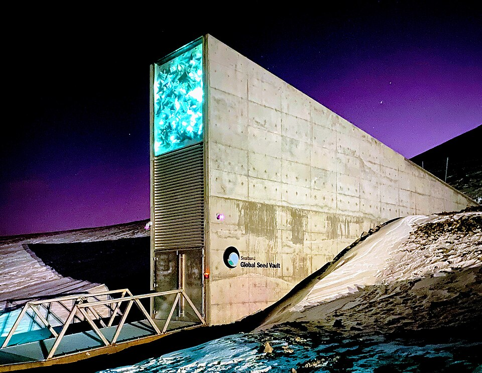

# Temas del curso

### 16/09 · Mis aficiones

Una de mis mayores aficiones es el fútbol.
Me gusta mucho jugar con mis amigos y entrenar con mi equipo varias veces a la semana.
Mi posición favorita es de delantero porque me gusta marcar goles y ayudar al equipo.
También disfruto viendo partidos importantes con mi familia, especialmente cuando juega mi equipo favorito.
El fútbol me ayuda a mantenerme en forma, trabajar en equipo y pasarlo bien con mis amigos.

Buscando en GitHub he encontrado [jokecamp](https://github.com/jokecamp/FootballData),
una web para ver datos de futbol.

[← Volver al inicio](README.md)

---

### 28/09 · Premios Princesa de Asturias: Bóveda Global de Semillas de Svalbard

[La Bóveda Global de Semillas de Svalbard](https://www.fpa.es/es/premios-princesa-de-asturias/premiados/2026-boveda-global-de-semillas-svalbard/) son tres almacenes inaugurados en 2008 que tienen una extensión de más de mil metros cuadrados,
está destinado a proteger y almacenar semillas de todos los cultivos destinados a alimentación para preservarlos en caso de perdida o extinción por cualquier motivo.
Lo premian por su labor social y medioambiental protegiendo la biodiversidad del planeta entero al almacenar semillas de todas las plantas para salvarlas de la extinción.
Elegí este premio ya que había oído hablar de este almacén enorme en el Artico.

Imagen: La Bóveda Global de Semillas de Svalbard, 

---
